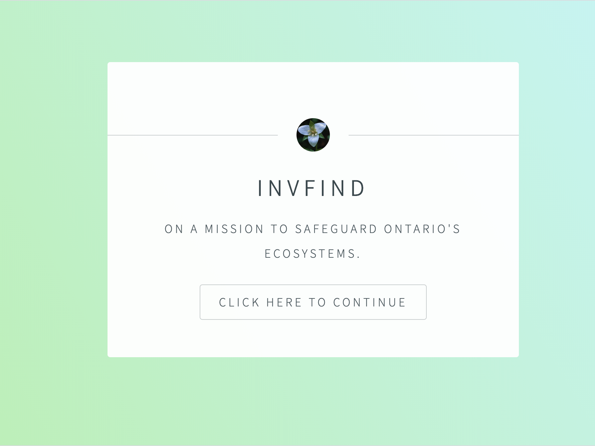
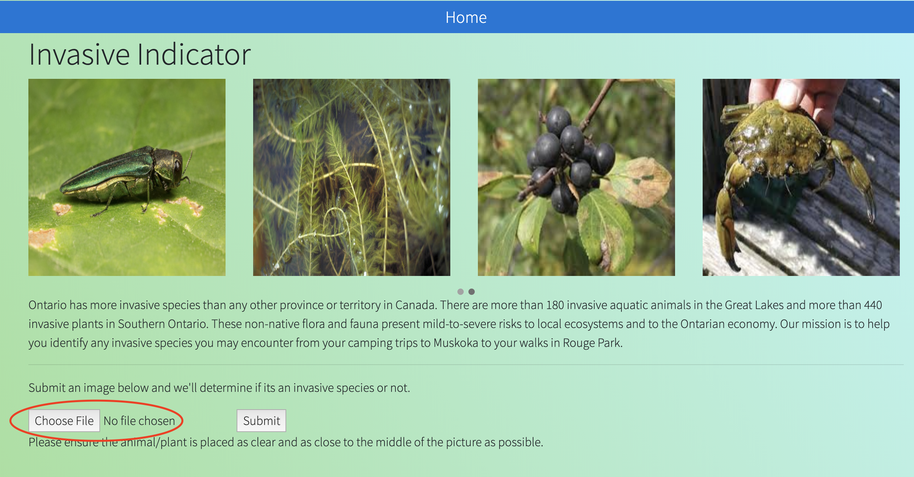

# DeltaHacks
InvFind, a scanner for some of Ontario's worst invasive species!
Created by Andrew Wang, Connor Byers, Molly Yu, Nick Makharinets.

Welcome to InvFind! This project has not been deployed yet so we'll walk you through the web app. This is a project built
using Flask, and the image recognition technology built using the Python Tensorflow Library. Essentially, we are using
Tensorflow to train our image-recognition neural network to distinguish between invasive and native species to the province of
Ontario, Canada. 

First you will be greeted by this homepage:

Which leads you to this page. Press the button circled in red and you will have the option to upload your own photo of an 
alleged invasive species. Press submit and our neural network will tell you if you encountered one.

If you did indeed encounter an invasive species, you will be led to a page that tells you so. If not, you will be led to a page
that will thank you for your effort in keeping our ecosystems safe :)

README to be continued...
